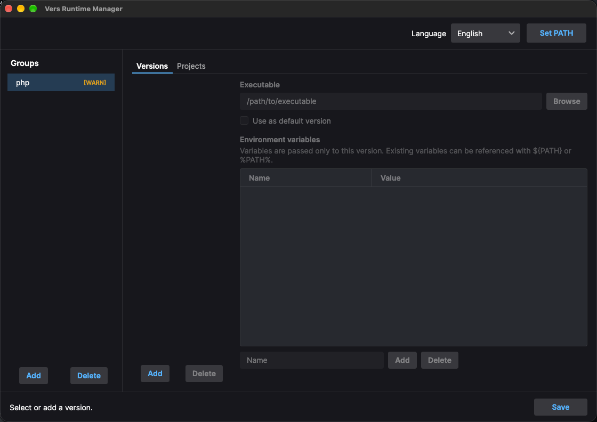

# Vers

Vers is a cross-platform GUI runtime switcher built with .NET 10, Avalonia, and Semi.Avalonia.
It creates command proxies for arbitrary groups such as `php`, `java`, and `node`, then selects the
real executable from the current directory, a temporary environment override, or the configured
default.

<p align="center">
  
</p>

## Usage

1. Create a group whose name is the command users will run, such as `php`, `java`, `mvn`, or
   `gradle`. Vers creates the matching proxy in its `bin` directory.
2. Add one or more versions to the group. Each version defines the real executable and any
   version-specific environment variables.
3. Choose a default version, then add project-directory mappings when a project needs a different
   version.
4. Click **Set PATH** once and reopen existing terminals.

When the current directory is a configured project directory, or any directory below it, invoking
the group command automatically routes to that project's selected version:

```bash
cd /work/my-project
php --version
java --version
mvn --version
gradle --version
```

Each group has independent project mappings, so the same project can use PHP 84, Java 21, Maven
3.9, and a specific Gradle version at the same time. Maven's actual command is normally `mvn`, so
use `mvn` as the group name if that is the command you want to intercept.

> [!NOTE]
> Maven and Gradle launch Java internally. If the selected `mvn` or `gradle` version defines
> `JAVA_HOME`, its launcher normally runs `$JAVA_HOME/bin/java` directly and does not pass through
> the Vers `java` proxy. If `JAVA_HOME` is not set and the launcher resolves `java` through PATH,
> configure the same project directory in the `java` group; otherwise Vers uses the Java group's
> default version. Gradle may reuse a daemon that was started with an older JVM, so run
> `gradle --stop` after changing Java settings.

## Managed files

On macOS and Linux, Vers stores its managed files under `~/.vers`. On Windows, it uses the working
directory from which `ver.exe` was started. Set `VERS_HOME` to override the root on any platform.

```text
<vers-root>/
├── util/tool[.exe]
├── bin/<group>[.exe]
└── data/settings.json
```

Creating or deleting a group creates or deletes its matching proxy in `bin`. This platform-specific
root selection is handled by adapters, so a future macOS `.app` does not depend on Finder's working
directory.

Vers does not write files into managed project directories, and it never modifies or deletes the
actual runtimes installed on the system. It only changes command routing through its PATH proxies.

## PATH priority

> [!WARNING]
> Shells run the first matching executable found in `PATH`. If `/usr/bin` appears before the Vers
> `bin` directory and contains `/usr/bin/php`, running `php` may bypass Vers. The same rule applies
> to every group and platform.

Vers only changes PATH after **Set PATH** is clicked:

- macOS/Linux: replaces one managed block in the user's shell profile and prepends `~/.vers/bin`.
- Windows: prepends the Vers `bin` directory to the system PATH. This requires UAC elevation.

Repeated setup does not add duplicate entries. After a PATH change, reopen existing terminals.

At startup and after configuration changes, Vers simulates command resolution for every configured
group. A group shows `[WARN]` when PATH resolves another executable first, or does not resolve the
command at all. Hover over the warning to see the resolved and expected paths.

Windows builds also create an extensionless WSL companion for every proxy. With standard WSL
Windows-PATH import enabled, commands such as `php` pass the converted working directory to the
Windows proxy.

## Version resolution

Resolution order for a proxy is:

1. `VER_<GROUP>_VERSION`, for example `VER_PHP_VERSION=84`
2. The longest matching project directory
3. The configured default version

Bind the current directory without opening the GUI:

```bash
php @bind:72
java @bind:27
```

The value after `@bind:` must exactly match a configured version name, ignoring letter case. `@bind`
or `@bind:` without a value prints all available version names and executable paths. Binding updates
`settings.json` and does not launch the underlying runtime.

Each version can define environment variables. They inherit the proxy process environment and may
reference existing values with `${NAME}`, `$NAME`, or `%NAME%`. `JAVA_HOME` is an ordinary manual
version setting; Vers does not infer it.

## Build and test

.NET 10 SDK is required.

```bash
dotnet build Vers.slnx
dotnet test Vers.slnx
```

Use `VERS_HOME` when testing first-run behavior without changing `~/.vers`:

```bash
VERS_HOME="$PWD/tmp/test/gui" dotnet run --project src/Vers.Gui/Vers.Gui.csproj
```

Build the macOS `.app` on macOS. The script detects Apple Silicon or Intel automatically:

```bash
./scripts/mac.sh
open artifacts/macos/Vers.app
```

Build the Windows executable from PowerShell on Windows. The script detects x64 or ARM64
automatically:

```powershell
./scripts/windows.ps1
./artifacts/windows/ver.exe
```

Published GUI builds and generated command proxies are self-contained, so the target machine does
not need a separate .NET installation. Native rendering libraries are embedded in the published
single-file GUI executable.

The editable icon source is `src/Vers.Gui/Assets/logo.png`. Generated `.ico` and `.icns` files live
beside it and are embedded by the platform packaging scripts.

## License

Vers is released under the [MIT License](LICENSE).
